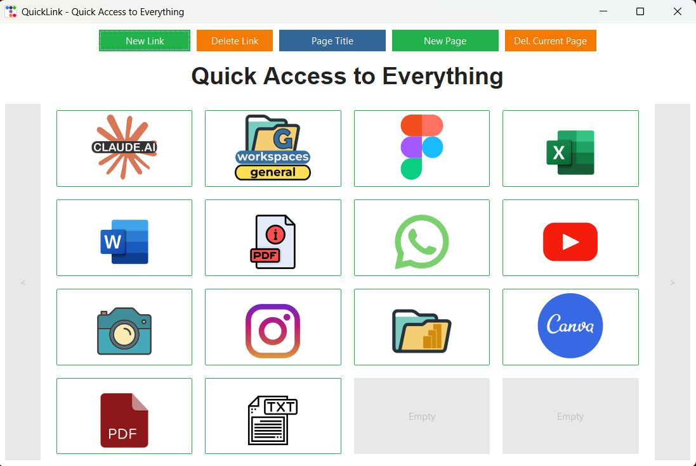

# QuickLink - Acesso Rápido a Tudo

## Descrição

O QuickLink é uma aplicação desktop desenvolvida em Python utilizando Tkinter com o tema ttkbootstrap e um banco de dados SQLite. O objetivo principal é fornecer uma maneira rápida e organizada de armazenar e acessar seus sites favoritos. Com uma interface intuitiva, você pode adicionar links, associar imagens a eles para fácil identificação visual e organizar seus links em múltiplas páginas.



## Funcionalidades Principais

* **Visualização em Grade:** Os links são exibidos em uma grade de 4x4 (16 links por página).
* **Adicionar Novo Link:**
    * Um botão dedicado permite adicionar novos links à página atual.
    * Ao clicar, uma janela (ou diálogo) se abrirá, solicitando:
        * **URL do Site:** O endereço web que você deseja salvar.
        * **Imagem Associada (Opcional):** Você pode selecionar um arquivo de imagem do seu computador para representar visualmente o link. Esta imagem será exibida na grade.
* **Excluir Link:**
    * Um botão para excluir links permite remover entradas indesejadas.
    * A aplicação fornecerá um mecanismo para selecionar qual link da página atual você deseja excluir.
    * Após a exclusão, a grade será atualizada.
* **Alterar Título da Página:**
    * Um botão permite modificar o título da página atualmente exibida.
    * Ao clicar, uma caixa de diálogo permitirá inserir um novo título.
    * O título será atualizado na parte superior da janela.
* **Adicionar Nova Página:**
    * Um botão para adicionar uma nova página permite expandir sua coleção de links além do limite de 16 por página.
    * Ao clicar, uma nova página vazia será criada.
* **Excluir Página Atual:**
    * Um botão para excluir a página atualmente visualizada permite remover páginas que não são mais necessárias.
    * **Aviso:** A exclusão da página será irreversível (com possível confirmação antes de prosseguir).
* **Navegação entre Páginas:**
    * Botões "Anterior" e "Próxima" permitem navegar facilmente entre as páginas de links que você criou.
    * A aplicação manterá o estado das páginas e dos links em cada uma.
* **Links Visuais:** Em vez de texto simples, os links são representados pelas imagens que você associou a eles. Clicar na imagem abrirá o URL correspondente no seu navegador web padrão.
* **Persistência de Dados:** Todos os seus links, imagens associadas e títulos de páginas são armazenados de forma persistente em um banco de dados SQLite local. Isso garante que seus dados sejam salvos mesmo após fechar e reabrir a aplicação.
* **Ícones da pasta assets:** Os ícones de exemplo foram baixados do site https://www.svgrepo.com/.

## Faça seus próprios ícones

* **"assets\make-your-own-icons.svg"** é o arquivo svg usado para criar as imagens. Use-o se quiser um ponto de partida para criar seus próprios ícones.

## Tecnologias Utilizadas

* **Python:** A linguagem de programação principal.
* **Tkinter:** A biblioteca GUI padrão do Python para criar a interface gráfica.
* **ttkbootstrap:** Uma biblioteca que fornece temas modernos e widgets estilizados para o Tkinter, melhorando a aparência da aplicação.
* **SQLite:** Um banco de dados relacional leve e embutido para armazenar os dados da aplicação (links, imagens, títulos).

## Como Usar

1.  **Executar a Aplicação:** Execute o script Python principal da aplicação.
    * Opcionalmente, baixe e execute o portable\QuickLink.exe. Não requer instalação.
2.  **Adicionar um Link:**
    * Clique no botão "Adicionar Link".
    * Na janela que se abrir, insira o URL do site desejado.
    * Opcionalmente, clique no botão para selecionar uma imagem do seu computador para associar ao link.
    * Clique em "Salvar" ou um botão similar para adicionar o link à grade da página atual.
3.  **Acessar um Link:** Clique na imagem do link desejado na grade. O URL associado será aberto no seu navegador padrão.
4.  **Excluir um Link:**
    * Clique no botão "Excluir Link".
    * A aplicação pode fornecer uma maneira de selecionar o link a ser excluído (por exemplo, clicando no link na grade).
    * Confirme a exclusão se necessário.
5.  **Alterar o Título da Página:**
    * Clique no botão "Alterar Título".
    * Na caixa de diálogo, digite o novo título desejado e clique em "OK".
6.  **Adicionar uma Nova Página:** Clique no botão "Adicionar Página". Uma nova página vazia será criada e exibida.
7.  **Excluir a Página Atual:** Clique no botão "Excluir Página". Confirme a exclusão se solicitado.
8.  **Navegar entre Páginas:** Use os botões "< Anterior" e "> Próxima" para mudar entre as páginas de links que você criou.

## Estrutura de Arquivos (Exemplo)

```
QuickLink/
├── quicklink.py         # Arquivo principal da aplicação
├── database.db         # Arquivo do banco de dados SQLite
├── assets/             # Pasta para armazenar imagens padrão (opcional)
└── README.md
```

## ⭐ Developer

- **Developer**: Hipolito Rodrigues
- **Creation Date**: 04/14/2025
- **Last Update**: 04/26/2025
- **Current Version**: 1.3

---

## 📜 License

This project is licensed under the MIT License. This means you are free to use, copy, modify, merge, publish, distribute, sublicense, and/or sell copies of the software, as long as you keep the original copyright notice and license included in all copies or substantial portions of the software.

* **Ícones da pasta assets:** Alguns icones de exemplo foram baixados do site [svgrepo.com](https://www.svgrepo.com/) , outros foram criados por mim.

```